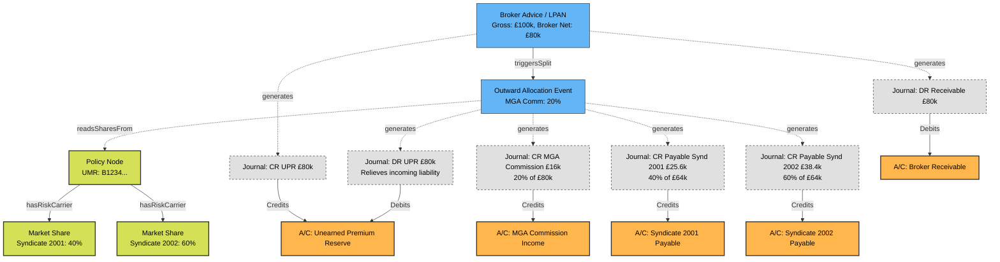

# Outward Ledger & Syndicate Allocation (The "Fan-Out")

## 1. The Business Challenge
In a subscription market (like Lloyd's), an MGA rarely retains 100% of the risk. An incoming Premium Advice (e.g., an LPAN for £100,000 Net) must be mathematically sliced. The MGA takes its over-riding commission (e.g., £20,000) and the remaining £80,000 is distributed across the carriers (Syndicates) based on their `MarketShare` percentages defined on the `Policy`.

## 2. Graph Shape & Modeling
Rather than hardcoding calculation steps into massive services, the graph structurally records the Fan-Out as an explicit immutable event (`OutwardAllocation`). This event is triggered by the incoming `BrokerAdvice` and binds the incoming UPR (Unearned Premium Reserve) to the outward payables and income.

## 3. Structural Observations
*   **Balance is maintained block-by-block:** The `BrokerAdvice` transaction balances to 0 (£80k DR - £80k CR). The `OutwardAllocation` transaction also balances to 0 (£80k DR - £16k CR - £25.6k CR - £38.4k CR).
*   **The UPR acts as a bridge:** The `BrokerAdvice` establishes the full £80k liability in the UPR. The `OutwardAllocation` immediately drains that UPR out and distributes it. Therefore, if the MGA retains 0% of the risk, their net UPR effectively becomes zero, while the payable accounts increment correctly.
*   **Payouts are seamless:** When it comes time to pay the Syndicates, we simply look for unpaid Credits in `AccPayS1` and link a new `CashDisbursement` event against them.