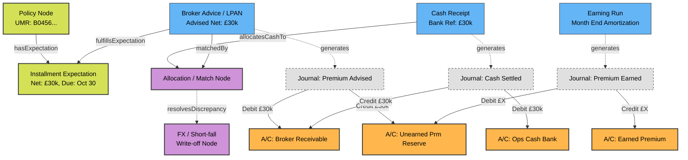

# Ledger Graph Architecture & Double-Entry Design

## 1. Graph Shape & Modeling

We treat accounting not as mutable rows in a database table updating a balance, but as immutable Event Nodes generating Journal sub-graphs points to Account nodes. 

This model gracefully supports highly complex London Market variants without technical noise. "Paid", "Short-fall", and "Earned" are derived graph states, not boolean flags.

## 2. Hypothesis Scenarios
*   **The Perfect Path:** Advice generates Debits and Credits. Cash arrives as a separate event generating more Jnl entries. A `Match` node links Advice and Cash. The `Receivable` account organically drops to zero balance visually on the graph.
*   **Short-fall / FX Variance:** If Cash doesn't equal Advice, the `Match` node acts as the pivot that also anchors a `Variance` event, which zeroes out the missing value without mutating the original Advice or Cash records.

## 3. Test-Driven Setup
The structure below is tested structurally by ensuring the fluent DSL views permit these types of relationships and mathematically tested by creating an array of journal elements and verifying balances.
